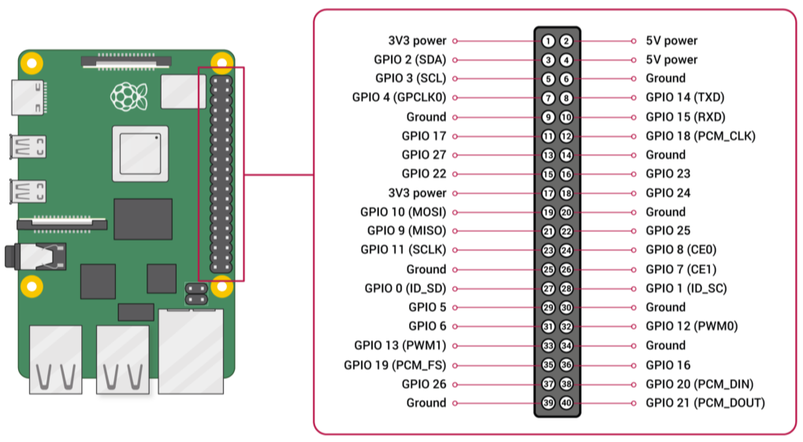
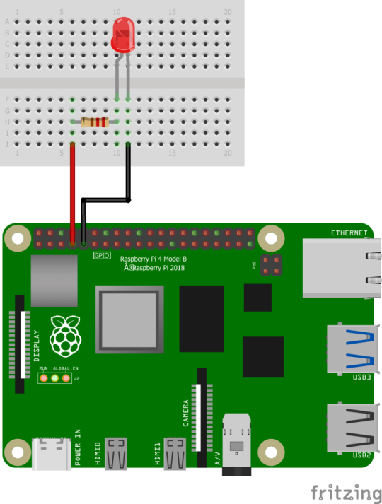

# Lab 1: Blinking LED

## Set up the circuit

Firstly you need to set up the LED circuit. To do that, you may need to understand the pinout of the RPI4. The pinout is as below:



In this lab, we will use two pins：pin #7 - GPIO 4 and pin #9 - GND. You may use others like pin #6 - GND and pin #12 - GPIO 18.

You may follow below diagram to set up the circuit.




# Write your code

In this lab, we will write a loop to blink the LED for a specific times, default is 5.

### Import the libraries

RPi.GPIO module is required, so it should be imported. Between the LED on and off, there will some pause, we will use time.sleep() method, thus time is also needed.


```
# Add necessary modules
import RPi.GPIO as gpio
import time
```

### Configure the pin

As shown on the abvoe circuit, pin #7-GPIO 4 and pin #9-GND are used.

```
# Configure the PIN connected to the LED
pin = 4
gpio.setmode(gpio.BCM)
gpio.setup(pin, gpio.OUT)
gpio.setwarnings(False)
```

### Write the loop

To light up the LED, you just need to use gpio.out() method to set the specific pin to 1.

```
# LED blinks for 5 times
times = 5
for i in range(0, times):
    gpio.output(pin, True)
    time.sleep(interval)
    gpio.output(pin, False)
    time.sleep(interval)
```

The source code can be found from [HERE](sources/test_Blinky_LED.py).

### Run the app

```
cd ~/Documents/blinkyLed/
python ./test_Blinky_Led.py
```


