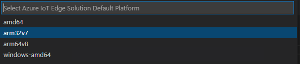
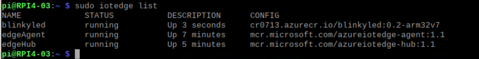

# Lab 3: Deploy the container through Azure IoT Edge

## Prerequisites:
- Lab 1 need to completed
- Lab 2 need to completed
- Azure IoT EdgeConnection String: `HostName=iothub-0707.azure-devices.net;DeviceId=RPI4-03;SharedAccessKey=XEEW*******************7B3NI=`
- Azure Container Registry:
  - Registry name: `cr0713`
  - Login Server: `cr0713.azurecr.io`
  - Username: `cr0713`
  - Pasword: `g4n**********************dKw`
- VS Code with below extensions:
  - Python
  - Azure account
  - Azure IoT tools

## Install Azure IoT Edge on RPI4

Follow this [guide](https://docs.microsoft.com/en-us/azure/iot-edge/how-to-install-iot-edge?view=iotedge-2018-06) to install Azure IoT Edge for Linux.

For RPI4, you may follow below script:

```
curl https://packages.microsoft.com/config/debian/stretch/multiarch/prod.list > ./microsoft-prod.list 
sudo cp ./microsoft-prod.list /etc/apt/sources.list.d/ 
curl https://packages.microsoft.com/keys/microsoft.asc | gpg --dearmor > microsoft.gpg 
sudo cp ./microsoft.gpg /etc/apt/trusted.gpg.d/ 
sudo apt-get update 
sudo apt-get install -y moby-engine 
sudo apt-get update 
sudo apt-get install -y iotedge

```

## Configure the runtime on RPI4

On RPI4, run below command:


```
sudo nano /etc/iotedge/config.yaml
```

Update the `connection string` to the above one.

## Create a python module in VS Code

1. In VS Code, press `Ctrl+Shift+P` to open the command palette -> Select `Azure: log in` -> Follow the instructions to sign in Azure China account.

2. In the command palette, run `Azure IoT Edge: New IoT Edge solution` -> Select folder -> Provide a solution name: `BlinkyLED` -> Select module template: `Python Module` -> Provide a module name: `BlinkyLED` -> Provide Docker image repository: `cr0713.azurecr.io/blinkyled`.

3. Add your registry credentials

   In VS Code, open `.env` -> update the fields:

   - CONTAINER_REGISTRY_USERNAME_cr0713=`cr0713`
   - CONTAINER_REGISTRY_PASSWORD_cr0713=`g4na**************rdKw`

4. Select target architecture

    Since we are using RPI4, the target architecture shall be `arm32v7`.

    You may open command palette and search `Azure IoT Edge: Set Default Target Plaform for Edge` -> Select `arm32v7`.

    

    You may also click the `amd64` icon from the status bar to make this change.

    


## Update the module with custom code

In VS Code explorer, open `modules\BlinkyLED` -> `main.py`.

Source code is [here](sources/main.py).


## Update deployment.template.json

In the VS Code explorer, open the `deployment.template.json` -> Remove `TemperatureThreshold` portion and `$edgeHub: "routes":{}`.

The template can be found [here](sources/deployment.template.json).

## Update module.json

You may remove the unnecessary ones.
```
{
  "$schema-version": "0.1",
  "description": "",
  "image": {
    "repository": "cr0713.azurecr.io/blinkyled",
    "tag": {
      "version": "0.1",
      "platforms": {
        "arm32v7": "./Dockerfile.arm32v7"
      }
    },
    "buildOptions": [],
    "contextPath": "./"
  },
  "language": "python"
}
```

The sample module.json file can be found [here](sources/azure-iotedge/module.json).

## Build and push your module

Open VS Code integrated terminal.

For **Azure China**, use below command:

```
docker login -u cr0714 -p 25M****************gwl cr0714.azurecr.cn
````

For **Azure Global**, use below:

```
docker login -u cr0713 -p g4n*****************dKw cr0713.azurecr.io
```

Right-click `deployment.template.json` -> `Build and push IoT Edge Solution`.

It may take a while to complete the docker build and docker push process.

## Deploy module to the target device

In VS Code explorer -> Config -> right-click on `deployment.arm32v7.json` -> select `Create Deployment for Single Device` -> Select IoT Device: `RPI4-03`.

You may verify the result from RPI4.



Once running, you will notice that the led will blink 10 times.