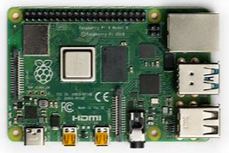
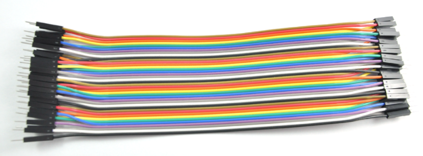
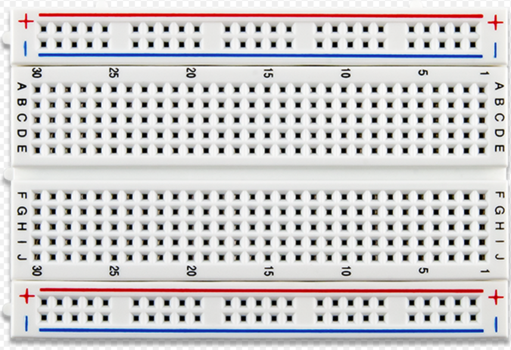
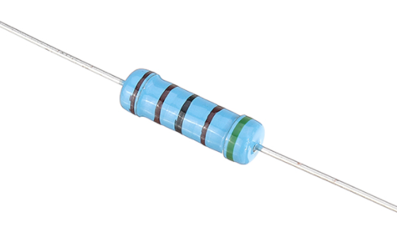

# Readme

This lab is to show you how to blink a LED on Raspberry Pi 4B.

## Prerequisites

- Windows 10 Dev PC
- Raspberry PI 4B, 4GB+ RAM, 16GB+ SD card
  
  

- Wire cable x2
  
  
  
- Breadboard x1

  

- Led x1
  
  
   

- Resistor x1

  

## Contents
- Lab 1: [Blinking LED](Lab1-Blinking_LED.md)
- Lab 2: [Docker build and run the app](Lab2-Docker_Build_and_Run.md)
- Lab 3: [Deploy the app through Azure IoT Edge](Lab3-Deploy_through_Azure_IoT_Edge.md)

<END> 